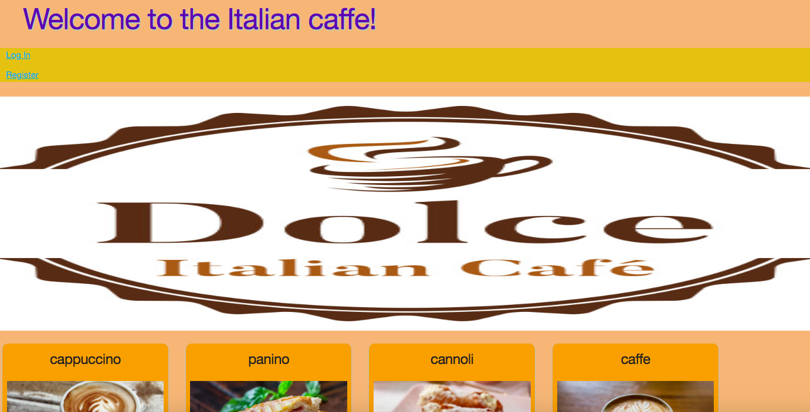

# caffegithubmichelecreanza.github.io

Michele coffe app

coffe link https://github.com/michelecreanza/caffegithubmichelecreanza.github.io/tree/master/coffe_app

Technologies Used:

Javascript
Jquery
Node.js
Mongoose
Express and EJS
RESTful routes and full CRUD.
sign up/log in functionality, with encrypted passwords & an authorization flow
Use EJS Partials
portfolio-quality styling
Google Maps
Paypal sandbox

A Coffe shop represents a shop All Product can be accessed via a particular id with Buy delete Update options
